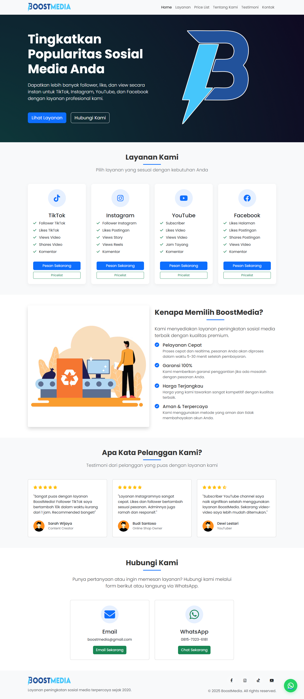
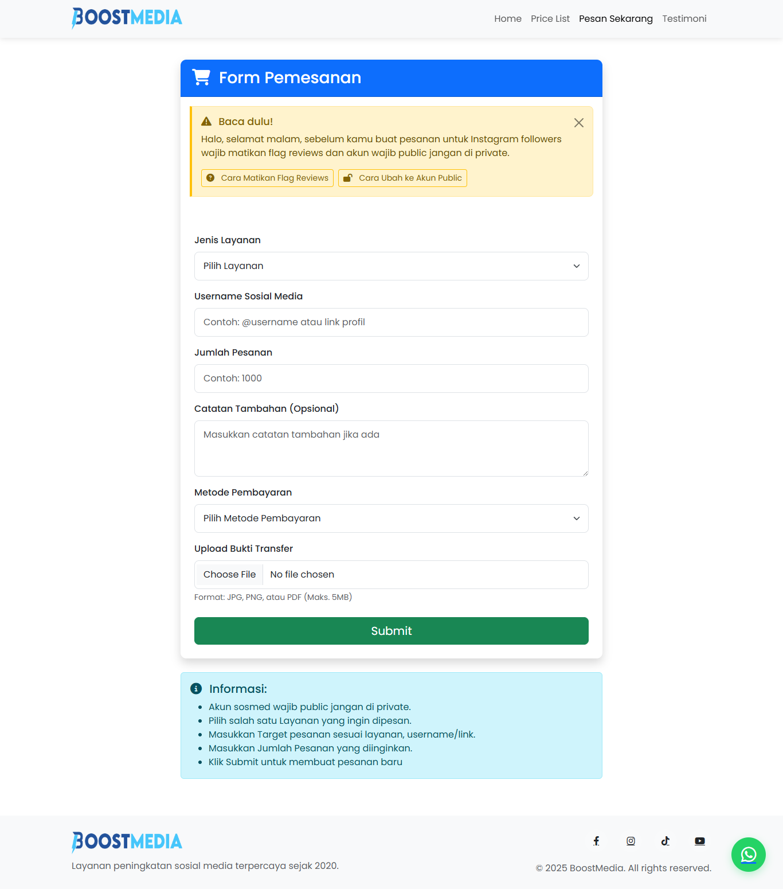

```markdown
# BoostMedia - Jasa Penambah Follower Sosial Media


Website resmi BoostMedia, penyedia jasa penambah follower, like, dan view untuk berbagai platform sosial media seperti Instagram, TikTok, YouTube, dan Facebook.

## Fitur Utama

✅ **Multi-Platform Support**:  
   - Instagram Followers/Likes/Views  
   - TikTok Followers/Likes/Views  
   - YouTube Subscribers/Likes/Views  
   - Facebook Page Likes/Post Likes  

✅ **Sistem Pemesanan Mudah**:  
   - Form pemesanan terintegrasi  
   - Pilihan metode pembayaran lengkap  
   - Konfirmasi otomatis via WhatsApp  

✅ **Fitur Khusus**:  
   - Peringatan persyaratan sebelum order  
   - Tampilan responsive untuk semua device  
   - Animasi modern dan user-friendly  

## Struktur File

```
boostmedia/
├── index.html              # Halaman utama
├── pricelist.html          # Daftar harga layanan
├── order.html              # Form pemesanan
├── css/
│   ├── style.css           # Stylesheet utama
├── js/
│   ├── script.js           # Script utama
│   └── order.js            # Script halaman pemesanan
├── images/                 # Folder gambar
│   ├── logo.png            # Logo BoostMedia
│   ├── hero-bg.jpg         # Background hero section
│   ├── qris.jpg            # QRIS Code
│   └── og-image.jpg        # Gambar untuk social media
```

## Teknologi Yang Digunakan

- **Frontend**:  
  
  
  
- **Optimasi**:  
  
  
  
- **Integrasi**:  
  

## Cara Instalasi

1. Clone repository:
   ```bash
   git clone https://github.com/aleaengineer/boostmedia.git
   ```

2. Buka folder project:
   ```bash
   cd boostmedia
   ```

3. Jalankan di browser:
   - Buka file `index.html` di browser favorit Anda

## Konfigurasi

Untuk menyesuaikan dengan kebutuhan Anda:

1. **Data Rekening**:  
   Ubah di file `order.html` pada bagian metode pembayaran

2. **Nomor WhatsApp**:  
   Ganti semua `6282129448933` dengan nomor Anda di:
   - `index.html`
   - `order.html`
   - `pricelist.html`
   - `order.js`

3. **Harga Layanan**:  
   Update harga di `pricelist.html`

## Persyaratan Sistem

- Browser modern (Chrome, Firefox, Edge versi terbaru)
- Akses internet untuk CDN Bootstrap dan Font Awesome

## Screenshot

  
*Halaman Utama BoostMedia*

  
*Form Pemesanan*

## Kontribusi

Pull request dipersilakan. Untuk perubahan besar, buka issue terlebih dahulu.

## Lisensi

[MIT](https://choosealicense.com/licenses/mit/)

---

**BoostMedia** © 2025 - [Hubungi Kami](https://wa.me/6282129448933)
```